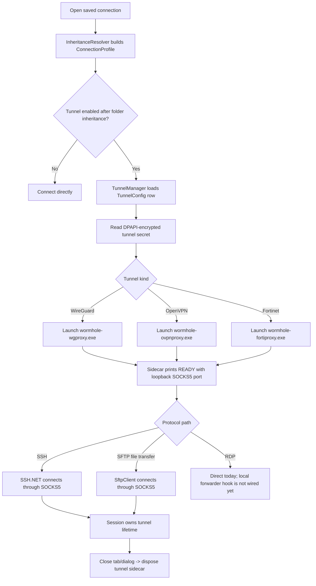

# Wormhole

A modern, tabbed, multi-protocol connection manager for Windows and a
philosophical sequel to [mRemoteNG](https://mremoteng.org).

> **Status:** 0.1.0 active development. The WinUI shell, persisted connection
> tree, connection editor, credential store, mRemoteNG import, SSH terminal,
> embedded/external RDP, SFTP file transfer, installer packaging, update checks,
> and per-connection VPN configuration are implemented. The standalone SFTP tab
> and RDP-over-VPN runtime path are still in progress.

## Why

mRemoteNG nailed something most remote clients still don't: a single window
with a **tree of saved servers**, folder-level inheritance for usernames /
ports / credentials, and tabs for every protocol. But its UI is stuck in 2010,
its last stable release is from 2019, and SFTP is a side feature, not a
first-class tab. Wormhole aims to keep what mRemoteNG got right and modernize
everything else.

## What works today

- Connection tree with folders, search, and drag-reorder.
- **Folder-level inheritance** — set a credential on a folder, every child inherits.
- Tabbed workspace.
- SSH terminal (xterm.js in WebView2, driven by SSH.NET).
- Embedded RDP session via the `mstscax` ActiveX control, with an external
  `mstsc.exe` fallback for Azure AD / WAM-sensitive targets.
- SFTP dual-pane file-transfer dialog from connected SSH tabs.
- DPAPI / Credential Manager-backed credential store.
- SQLite-backed connection store with a versioned schema.
- mRemoteNG `confCons.xml` import.
- Per-connection userspace VPN tunnel configs for WireGuard, OpenVPN, and
  Fortinet SSL VPN.
- Modern WinUI 3 shell: Mica backdrop, dark mode, per-monitor DPI.

## Planned

- Standalone SFTP session tab.
- RDP routing through per-connection VPN tunnels.
- VNC and Telnet protocols.
- External Tools with `{host}` / `{user}` templating.
- Port scan → "add as connection."
- Windows Hello unlock, optional 1Password / Bitwarden / Azure Key Vault providers.
- SSH local/remote port forwarding UI.
- Ctrl+K command palette.

## Per-connection VPN

VPN tunnels are stored independently from connections and attached from the
connection editor. A folder can provide a tunnel for all descendants, a child
connection can inherit it, choose a different tunnel, or explicitly disable
tunneling with "No tunnel".

Tunnel rows live in SQLite; the provider-specific secret payload is
DPAPI-encrypted under `%LOCALAPPDATA%\Wormhole\tunnels\`. At connect time the
resolved profile decides whether a tunnel is needed. Tunnel providers launch a
userspace sidecar (`wormhole-wgproxy.exe`, `wormhole-ovpnproxy.exe`, or
`wormhole-fortiproxy.exe`) and consume the local SOCKS5 endpoint it reports.
No OS routes, adapters, DNS settings, or admin privileges are required.

Current runtime routing uses the tunnel for SSH terminal sessions and SFTP file
transfer. The RDP local-forwarder abstraction exists, but `RdpSessionViewModel`
does not yet wire it into the ActiveX/external-client path.



## Requirements

- Windows 10 19041 (20H1) or later, on x64 or arm64.
- .NET 10 SDK to build.
- [WebView2 runtime](https://developer.microsoft.com/microsoft-edge/webview2/) (evergreen; installed by default on modern Windows).

## Build from source

```powershell
dotnet restore
dotnet build Wormhole.csproj -c Debug -p:Platform=x64
dotnet test  Wormhole.Tests/Wormhole.Tests.csproj
```

Then run `bin\x64\Debug\net10.0-windows10.0.19041.0\Wormhole.exe`.

VPN integration tests require Linux/WSL2 and Docker:

```bash
cd tests/vpn-fixtures
./bootstrap.sh
docker compose up -d
cd ../..
dotnet test Wormhole.Tests.Integration/Wormhole.Tests.Integration.csproj
```

## Stack

| Concern | Choice |
|---|---|
| UI framework | WinUI 3 (Windows App SDK 1.8.x) |
| MVVM | CommunityToolkit.Mvvm |
| DI | Microsoft.Extensions.DependencyInjection |
| Logging | Serilog → Microsoft.Extensions.Logging |
| SSH + SFTP | SSH.NET |
| Terminal renderer | xterm.js inside WebView2 |
| RDP | `mstscax` ActiveX (in-box) hosted via WinForms reparenting |
| VPN tunnels | Userspace WireGuard / OpenVPN / Fortinet sidecars exposing loopback SOCKS5 |
| Credentials | Meziantou.Framework.Win32.CredentialManager + DPAPI |
| Database | SQLite via Microsoft.Data.Sqlite + Dapper |
| Import | mRemoteNG XML importer with BouncyCastle for legacy AES-GCM shape |

See [AGENTS.md](AGENTS.md) for architecture notes and conventions.

## License

Wormhole is licensed under the **GNU Affero General Public License v3.0 or later**
(AGPL-3.0-or-later). See [LICENSE](LICENSE) for the full text.

Why AGPL: Wormhole vendors OpenVPN3-core (AGPL-3.0) to provide userspace OpenVPN
tunnel support without touching the OS network stack. AGPL is the lowest-friction
license compatible with that dependency. Practical implications:

- You can use, modify, distribute, and run Wormhole freely.
- Derivative works (forks, modifications) must also be AGPL-3.0-or-later.
- If you run a modified Wormhole as a network service, you must offer the
  modified source to your users (the AGPL §13 "network use" clause). For a
  desktop SSH/RDP/SFTP client this rarely applies in practice.
- Commercial use is permitted; making proprietary forks is not.

Third-party dependencies and their licenses are documented in
[THIRD_PARTY_LICENSES.md](THIRD_PARTY_LICENSES.md).
