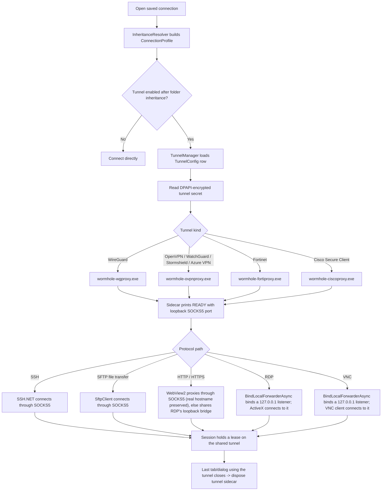

# Wormhole

A modern, tabbed, multi-protocol connection manager for Windows and a
philosophical sequel to [mRemoteNG](https://mremoteng.org).

> **Status:** Active development, UNSTABLE. The WinUI shell,
> persisted connection tree, connection editor, credential store, mRemoteNG
> import, SSH terminal, serial terminal, embedded/external RDP, embedded VNC,
> SFTP file transfer, HTTP/HTTPS web sessions, optional Bitwarden integration,
> per-connection VPN across seven providers (including RDP, VNC, and web over
> VPN), an opt-in MCP server for AI-driven SSH control, installer packaging,
> and in-app update checks are all implemented.

## Why

mRemoteNG nailed something most remote clients still don't: a single window
with a **tree of saved servers**, folder-level inheritance for usernames /
ports / credentials, and tabs for every protocol. But its UI is stuck in 2010,
its last stable release is from 2019, and SFTP is a side feature, not a
first-class tab. Wormhole aims to keep what mRemoteNG got right and modernize
everything else.

## What works today

- Connection tree with folders, search, and drag-reorder.
- **Folder-level inheritance** — set a credential (or VPN tunnel, or any RDP
  setting) on a folder and every child inherits it.
- Tabbed workspace for SSH, RDP, VNC, HTTP/HTTPS web, and Serial sessions.
- SSH terminal (xterm.js in WebView2, driven by SSH.NET), with either a saved
  credential reference or an inline per-connection username/password.
- Embedded RDP session via the `mstscax` ActiveX control, with an external
  `mstsc.exe` fallback for Azure AD / WAM-sensitive targets.
- Embedded VNC session support (`ProtocolType.Vnc = 6`, with enum value `2`
  still reserved for retired SFTP) using `Community.MarcusW.VncClient`.
  VNC v1 supports no-auth servers and classic password authentication; VNC
  credentials are password-only.
- **HTTP / HTTPS web sessions** that render a target web GUI — e.g. a firewall or
  appliance management page — in an embedded WebView2 browser tab. No
  credentials; HTTPS offers an opt-in "ignore certificate errors" toggle for
  self-signed appliance certs. The motivating case is reaching an appliance GUI
  that sits behind a per-connection VPN tunnel.
- **Serial terminal sessions** using the same xterm.js terminal surface as SSH,
  with PuTTY-style serial-line settings: baud rate, data bits, stop bits, parity,
  and None / XON-XOFF / RTS-CTS / DSR-DTR flow control.
- SFTP dual-pane file-transfer dialog from connected SSH tabs. The SFTP session
  is pre-warmed in the background as soon as the shell connects, so the dialog
  opens instantly.
- DPAPI / Credential Manager-backed credential store.
- Optional **Bitwarden Password Manager** integration for saved credential
  passwords, plus the official Bitwarden browser extension inside HTTPS
  WebView2 sessions. Enable it from **Settings -> Extensions -> Bitwarden**.
- SQLite-backed connection store with a versioned schema.
- mRemoteNG `confCons.xml` import.
- Per-connection userspace VPN tunnels for **WireGuard, OpenVPN, Fortinet SSL
  VPN, WatchGuard Mobile VPN with SSL, Stormshield Network SSL VPN, Azure VPN
  (Microsoft Entra ID P2S), and Cisco Secure Client (AnyConnect)** — used by SSH,
  SFTP, RDP, VNC, and HTTP/HTTPS sessions. Serial sessions are local COM-port
  sessions and are not VPN-routed.
- Opt-in **MCP server** that lets AI agents drive your already-open SSH sessions
  over an authenticated loopback endpoint.
- Modern WinUI 3 shell: Mica backdrop, dark mode, per-monitor DPI.

## Planned

- Telnet protocol.
- Advanced VNC auth modes beyond no-auth and classic password auth.
- External Tools with `{host}` / `{user}` templating.
- Port scan → "add as connection."
- Windows Hello unlock, optional 1Password / Azure Key Vault providers.
- SSH local/remote port forwarding UI.
- Ctrl+K command palette.

## Bitwarden integration

Bitwarden is optional. Windows Credential Manager remains the default credential
vault, and existing local credentials keep working unchanged.

Enable Bitwarden from **Settings -> Extensions -> Bitwarden**. The settings page
contains two independent integrations:

- **Credential vault** - Wormhole uses the official Bitwarden Password Manager
  CLI (`bw`) to resolve saved credential passwords from your personal Bitwarden
  vault. Wormhole can install/update the CLI automatically, keeps the session key
  only in memory, and never stores Bitwarden passwords in SQLite, backups, logs,
  or metadata caches.
- **Browser extension for HTTPS windows** - Wormhole installs the official
  Bitwarden browser extension into dedicated persistent WebView2 profiles for
  HTTPS sessions. The extension owns login, unlock, sync, and autofill exactly
  like it does in a browser; Wormhole only provides the toolbar button and the
  WebView2 extension host. Authentication cookies in these HTTPS profiles persist
  across Wormhole restarts and updates.

Bitwarden login items appear as read-only virtual credentials in the Credentials
page and in SSH / RDP / VNC credential pickers after sync. Selecting one stores
only a Bitwarden item reference on the Wormhole credential or connection. At
connect time, Wormhole resolves `login.password` live through `bw`; if the vault
is locked, Wormhole prompts to unlock it.

The HTTPS extension is installed from official Bitwarden Browser releases and is
kept up to date in the background for official installs. Manual ZIP or unpacked
folder installs are supported for offline or enterprise environments and remain
pinned. Backup/export includes Bitwarden item references and metadata cache, but
never exports Bitwarden passwords, WebView2 profiles, or extension packages.

## Per-connection VPN

VPN tunnels are stored independently from connections and attached from the
connection editor. A folder can provide a tunnel for all descendants; a child
connection can inherit it, choose a different tunnel, or explicitly disable
tunneling with "No tunnel" (`TunnelEnabled` is tri-state: inherit / off / on).

Tunnel rows live in SQLite; the provider-specific secret payload is
DPAPI-encrypted under `%LOCALAPPDATA%\Wormhole\tunnels\`. At connect time the
resolved profile decides whether a tunnel is needed. Tunnel providers launch a
userspace sidecar and consume the local SOCKS5 endpoint it reports. **No OS
routes, adapters, DNS settings, or admin privileges are required.**

Four sidecars cover all seven providers — WatchGuard, Stormshield, and Azure VPN
synthesize an OpenVPN profile in managed code and reuse the shared OpenVPN
sidecar rather than shipping their own binary:

| Provider | Sidecar |
|---|---|
| WireGuard | `wormhole-wgproxy.exe` |
| OpenVPN, WatchGuard, Stormshield, Azure VPN | `wormhole-ovpnproxy.exe` |
| Fortinet | `wormhole-fortiproxy.exe` |
| Cisco Secure Client (AnyConnect) | `wormhole-ciscoproxy.exe` |

Fortinet supports either the existing username/password flow (including a saved
TOTP secret) or SAML SSO. SAML can run in a dedicated persistent WebView2 profile,
which preserves the IdP session, or in the system browser. The external-browser
flow reserves a loopback callback before opening the gateway and uses port
`8020` by default; configure the same value as FortiGate's
`saml-redirect-port` when a different port is required. A Fortinet realm can be
used with embedded WebView2, but Fortinet does not support combining a realm with
the external-browser redirect flow.

The Fortinet SAML `auth_id` or `SVPNCOOKIE` is ephemeral: Wormhole passes exactly
one of them to the sidecar over stdin and never persists it. The embedded
certificate-bypass option applies only to the configured gateway origin; the
system browser keeps its own TLS policy. The configured SHA-256 certificate pin
still protects the sidecar and tunnel-data connection. Because WebView2 cannot
enforce a leaf-certificate pin for every valid TLS connection, embedded SSO
rejects configurations with a pin; use the system browser for pinned tunnels.

Cisco Secure Client remains non-interactive: it generates a code from a saved
TOTP secret (or falls back to a static secondary password). WatchGuard (pre-auth
challenge loop) and Stormshield (portal config download) instead prompt for the
code at connect time through a single in-app OTP dialog.

Cisco Secure Client speaks the AnyConnect protocol directly (aggregate-auth XML
login + CSTP tunnel) rather than driving the locally-installed Cisco client, so
no Cisco software needs to be installed. It currently supports
username/password, an optional tunnel group, and the TOTP / secondary-password
second factor above; **SAML single sign-on, client-certificate authentication,
and endpoint posture (CSD/HostScan) are not yet supported**, so gateways that
require them will reject the connection.

SSH terminal sessions and SFTP file-transfer dialogs route through the sidecar's
loopback SOCKS5 endpoint. RDP and VNC cannot speak SOCKS5 directly, so the
embedded clients route through `ITunnelInstance.BindLocalForwarderAsync`, which
binds a `127.0.0.1` listener that bridges to the real target through the tunnel.
Three RDP + tunnel combinations are rejected because the loopback bridge can't
safely handle them: the external `mstsc.exe` client, RD Gateway, and strict
server authentication. VNC uses the same loopback-forwarder path without those
RDP-specific certificate/gateway constraints.

HTTP/HTTPS sessions route through a hybrid of the two. When the tunnel exposes a
SOCKS5 endpoint, the WebView2 is launched with a `--proxy-server=socks5://…` so
it connects to the **real** hostname (correct SNI, certificate, and redirects).
When it doesn't, the browser falls back to the same `127.0.0.1` loopback bridge
as RDP — where the loopback name won't match the appliance certificate, so HTTPS
over that path needs the "ignore certificate errors" opt-in.

Connections that use the same saved tunnel share a single live instance: each
session holds a ref-counted lease, concurrent connects coalesce into one
establishment (so an OTP-interactive VPN prompts once, not once per tab), and
the sidecar is torn down when the last session using it closes. Editing a
tunnel config applies to new connections — sessions already running on the old
settings keep their tunnel until they disconnect.



## AI agent control (MCP)

Wormhole embeds an opt-in [Model Context Protocol](https://modelcontextprotocol.io)
server so AI agents can drive your **already-open** SSH sessions. It is off by
default; enable it in Settings to start a loopback-only HTTP endpoint
(`http://127.0.0.1:8765` by default), protected by a bearer token stored in
Windows Credential Manager and regenerable from Settings.

The tool surface is intentionally narrow and limited to sessions you already
have open:

- `list_sessions` — enumerate connected SSH sessions.
- `run_command` — run one shell command and capture its output and exit code.
- `send_text` — type raw text / control sequences into a session.
- `read_terminal` — read recent scrollback (ANSI stripped).

There is **no** tool to open a connection or read saved credentials, and the
first agent action on any session prompts you to approve AI control.

## Requirements

Running a release build:

- Windows 10 19041 (20H1) or later, on x64 or arm64.
- [WebView2 runtime](https://developer.microsoft.com/microsoft-edge/webview2/)
  (evergreen; installed by default on modern Windows).
- No separate .NET install — release builds are self-contained.

Building from source additionally requires the **.NET 10 SDK**.

## Build from source

```powershell
git submodule update --init --recursive   # vendored OpenVPN3 sources (see below)
dotnet restore
dotnet build Wormhole.csproj -c Debug -p:Platform=x64
dotnet test  Wormhole.Tests/Wormhole.Tests.csproj
```

Then run `bin\x64\Debug\net10.0-windows10.0.19041.0\Wormhole.exe`.

The real userspace OpenVPN sidecar (and the WatchGuard / Stormshield providers
that reuse it) needs the vendored OpenVPN3 sources plus a C++ toolchain. Without
them the build still succeeds, but the OpenVPN sidecar is a stub and OpenVPN-based
tunnels fail at runtime. Released x64 builds ship the real sidecar; arm64 ships
the stub.

The installer is built with [Inno Setup](https://jrsoftware.org/isinfo.php) 6:

```powershell
scripts/Build-Installer.ps1 -Configuration Release -Architecture x64
```

VPN integration tests require Linux/WSL2 and Docker:

```bash
cd tests/vpn-fixtures
./bootstrap.sh
docker compose up -d
cd ../..
dotnet test Wormhole.Tests.Integration/Wormhole.Tests.Integration.csproj
```

## Stack

| Concern | Choice |
|---|---|
| UI framework | WinUI 3 (Windows App SDK 2.1.x) |
| MVVM | CommunityToolkit.Mvvm |
| DI | Microsoft.Extensions.DependencyInjection |
| Logging | Serilog → Microsoft.Extensions.Logging |
| SSH + SFTP | SSH.NET |
| Terminal renderer | xterm.js inside WebView2 |
| RDP | `mstscax` ActiveX (in-box) hosted via WinForms |
| VNC | `Community.MarcusW.VncClient` |
| Web browser (HTTP/HTTPS) | WebView2 (Chromium); per-session SOCKS5 proxy when tunneled |
| VPN tunnels | Userspace WireGuard / OpenVPN / Fortinet / WatchGuard / Stormshield / Azure VPN / Cisco Secure Client sidecars exposing loopback SOCKS5 |
| AI control | ModelContextProtocol.AspNetCore (loopback MCP server over Kestrel) |
| Credentials | Meziantou.Framework.Win32.CredentialManager + DPAPI, with optional Bitwarden Password Manager via `bw` CLI |
| Database | SQLite via Microsoft.Data.Sqlite + Dapper |
| Import | mRemoteNG XML importer with BouncyCastle for legacy AES-GCM shape |

See [CLAUDE.md](CLAUDE.md) for architecture notes and conventions.

## License

Wormhole is licensed under the **GNU Affero General Public License v3.0 or later**
(AGPL-3.0-or-later). See [LICENSE](LICENSE) for the full text.

Why AGPL: Wormhole vendors OpenVPN3-core (AGPL-3.0) to provide userspace OpenVPN
tunnel support without touching the OS network stack. AGPL is the lowest-friction
license compatible with that dependency. Practical implications:

- You can use, modify, distribute, and run Wormhole freely.
- Derivative works (forks, modifications) must also be AGPL-3.0-or-later.
- If you run a modified Wormhole as a network service, you must offer the
  modified source to your users (the AGPL §13 "network use" clause). For a
  desktop SSH/RDP/SFTP client this rarely applies in practice.
- Commercial use is permitted; making proprietary forks is not.

Third-party dependencies and their licenses are documented in
[THIRD_PARTY_LICENSES.md](THIRD_PARTY_LICENSES.md).
