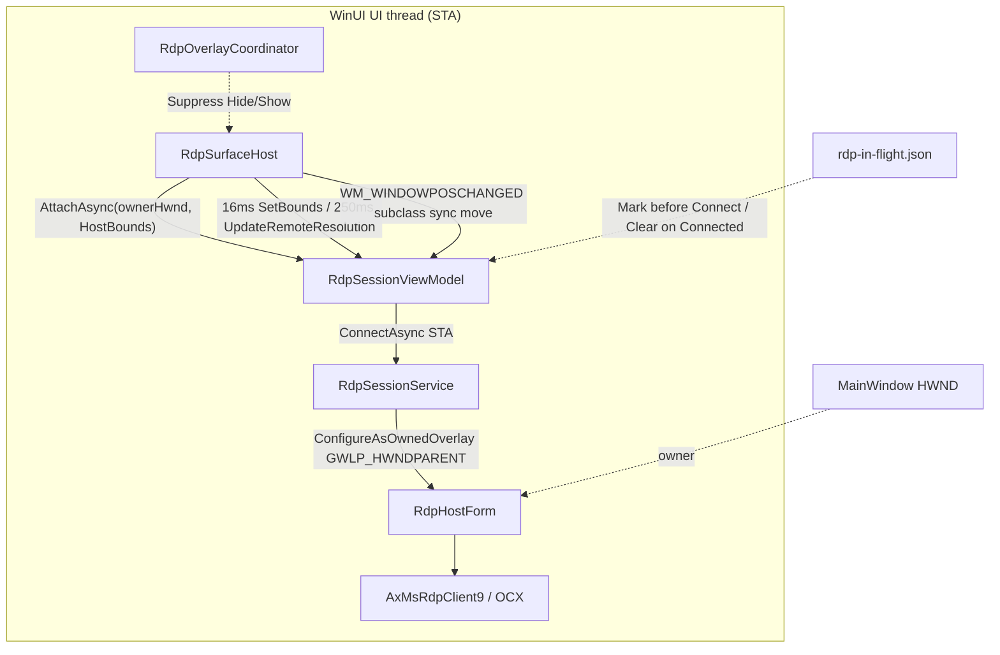
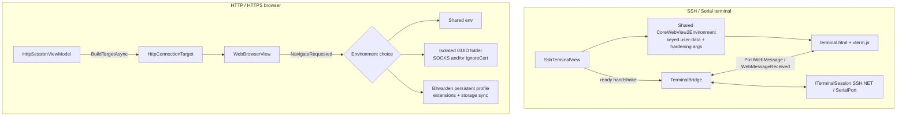

# NativeSurfaceBroker — C# surface hosting + Rust status

This document captures how Wormhole currently hosts **RDP ActiveX** and **WebView2**
surfaces in C#, and how the Rust parallel tree mirrors those contracts under
[`wormhole-surface-win`](../../rust/crates/wormhole-surface-win/). It is derived from
the live C# code (read-only survey) plus the current Rust crate layout.

Historical comments that still say "SetParent / reparented child" are **stale**: RDP
is an **owned top-level overlay**, not a `WS_CHILD` of the shell HWND. Rust follows
the same rule (`GWLP_HWNDPARENT` + `WS_EX_TOOLWINDOW` — see
[`rdp/overlay.rs`](../../rust/crates/wormhole-surface-win/src/rdp/overlay.rs)).

**Evidence honesty:** surface-lab / crate unit tests are **`LabOnly`**. They do **not**
satisfy [gate-checklist.md](gate-checklist.md) hardware boxes. See
[gate-evidence-log.md](gate-evidence-log.md) — **no row claims `HardwarePass`**.

Related spike notes: [05-rdp-spike.md](05-rdp-spike.md), [08-focus-a11y.md](08-focus-a11y.md),
[08-ui.md](08-ui.md) (pane-layout sink), [09-vnc.md](09-vnc.md), [10-http.md](10-http.md).

---

## 1. Current C# architecture

### High-level (ASCII)

```
WinUI MainWindow (owner HWND)
├── XAML session slot (RdpSurfaceHost / SshTerminalView / WebBrowserView)
│     layout slot only — Grid may be empty for RDP
│
├── RDP path (owned overlay ABOVE XAML — not SetParent)
│     RdpSurfaceHost ──AttachAsync──► RdpSessionViewModel
│           │                              │
│           │ layout ticks / subclass      ├── crash sentinel Mark/Clear
│           │ screen HostBounds            ├── tunnel BindLocalForwarder (RDP/VNC)
│           ▼                              ▼
│     RdpSessionService.ConnectAsync (STA)
│           │  GWLP_HWNDPARENT = main HWND
│           │  WS_EX_TOOLWINDOW
│           ▼
│     RdpHostForm (WinForms, WS_POPUP overlay)
│           └── AxMsRdpClient9 (mstscax CLSID 11→10→9)
│                 IDispatch dynamic props + IConnectionPoint events
│
└── WebView2 paths (in-tree composition; Visibility collapse for airspace)
      ├── SshTerminalView → shared env + virtual host → TerminalBridge ↔ ShellStream
      └── WebBrowserView  → shared | isolated | Bitwarden profile env → Navigate
```

### Mermaid — RDP overlay hosting



### Mermaid — WebView2 surfaces



### Critical design choice: owned overlay vs SetParent

`RdpSessionService.ConfigureAsOwnedOverlay` deliberately does **not** call
`SetParent` / `WS_CHILD`. Reparenting composites the OCX **behind** WinUI 3's
DirectComposition surface (airspace). Instead:

| Step | API / effect |
|------|----------------|
| Ownership | `SetWindowLongPtr(GWLP_HWNDPARENT, ownerHwnd)` |
| Taskbar / Alt-Tab | OR `WS_EX_TOOLWINDOW` |
| Activatable | Do **not** set `WS_EX_NOACTIVATE` (click must focus OCX) |
| Position | Screen physical px via `ClientToScreen` + element offset × `RasterizationScale` |
| Show / hide | `ShowWindow(SW_SHOWNA)` / `SW_HIDE`; programmatic moves use `SWP_NOACTIVATE` |

`SetParent` remains declared in `Win32Interop` but is **not** the RDP hosting path.

WebView2 stays in the XAML tree. Airspace bleed for background tabs is solved by
collapsing `Visibility` on the `WebView2` control (and an RDP-style Hide for the
overlay HWND).

---

## 2. Rust reality — `wormhole-surface-win`

Production shell is still WinUI. The Rust broker is a **skeleton + lab spike**, not a
cutover. Status for every surface-lab gate that exercises this crate is **`LabOnly`**
([gate-evidence-log.md](gate-evidence-log.md)).

### Crate map

| Piece | Location | Feature |
|-------|----------|---------|
| Trait + stub broker | [`broker.rs`](../../rust/crates/wormhole-surface-win/src/broker.rs) — `NativeSurfaceBroker`, `StubNativeSurfaceBroker` | default |
| Physical bounds / visibility | [`bounds.rs`](../../rust/crates/wormhole-surface-win/src/bounds.rs), [`zorder.rs`](../../rust/crates/wormhole-surface-win/src/zorder.rs) | default |
| **GWLP_HWNDPARENT** overlay HWND | [`rdp/overlay.rs`](../../rust/crates/wormhole-surface-win/src/rdp/overlay.rs) | `rdp` |
| OLE / OCX / CredSSP / connect stub | [`rdp/`](../../rust/crates/wormhole-surface-win/src/rdp/) (`host`, `ocx`, `configure`, `credssp_connect_glue`, `events`, …) | `rdp` |
| RDP dial-target + forwarder stub | [`rdp/target.rs`](../../rust/crates/wormhole-surface-win/src/rdp/target.rs) — `select_rdp_connect_target`, `FakeTunnelForwarder` | `rdp` |
| Crash sentinel / HostBounds / resolution debounce | [`rdp/sentinel.rs`](../../rust/crates/wormhole-surface-win/src/rdp/sentinel.rs), `host_bounds`, `resolution` | always (no mstscax) |
| WebView2 child host (wry) | [`webview/`](../../rust/crates/wormhole-surface-win/src/webview/) | `webview` |
| **`cert_policy` adapter** | [`webview/cert_policy.rs`](../../rust/crates/wormhole-surface-win/src/webview/cert_policy.rs) — `cert_policy_to_webview2_behavior` + leaf/target glue | `webview` |
| **`BrokerPaneLayoutSink`** | [`pane_layout.rs`](../../rust/crates/wormhole-surface-win/src/pane_layout.rs) | `pane-layout` |
| **Pane focus glue** | [`pane_focus.rs`](../../rust/crates/wormhole-surface-win/src/pane_focus.rs) — `activate_pane` / `cycle_pane_focus` → `WorkspaceState` + `FocusRequest` | `pane-layout` |
| **Session surface glue** | [`session_surface.rs`](../../rust/crates/wormhole-surface-win/src/session_surface.rs) — open → bind; close → unbind + Fake dispose | `pane-layout` |
| **Pane split/merge notify** | [`pane_split.rs`](../../rust/crates/wormhole-surface-win/src/pane_split.rs) — split/merge → `on_pane_layout` Fake tick | `pane-layout` |
| **`FocusCycle` + FocusBroker** | [`focus/cycle.rs`](../../rust/crates/wormhole-surface-win/src/focus/cycle.rs), [`focus/`](../../rust/crates/wormhole-surface-win/src/focus/) | default |
| Lab harness | [`surface-lab`](../../rust/crates/surface-lab/) gates 1–8 | per-gate features |

### Owned overlay (not SetParent) — Rust

Same contract as C# / [05-rdp-spike.md](05-rdp-spike.md):

| Step | Win32 |
|------|--------|
| Window style | `WS_POPUP` (never `WS_CHILD` / `SetParent`) |
| Owner | `SetWindowLongPtr(GWLP_HWNDPARENT, ownerHwnd)` |
| Taskbar / Alt-Tab | OR `WS_EX_TOOLWINDOW` |
| Activatable | Do **not** set `WS_EX_NOACTIVATE` |
| Show / move | `ShowWindow(SW_SHOWNA)` / `SetWindowPos(…, SWP_NOACTIVATE)` |
| Threading | Dedicated **STA** + `OleInitialize` + message pump for OCX |

`NativeSurfaceBroker::unregister` docs and crate root comments explicitly forbid
SetParent for RDP. Lab gate 6 (`gate06_rdp_activex`) smokes the overlay OLE path —
**LabOnly**, not a hardware COM/reconnect pass.

### `BrokerPaneLayoutSink`

`wormhole_ui::PaneLayoutSink` → `NativeSurfaceBroker::update_bounds` adapter
(`--features pane-layout`). Binds `PaneId` → registered `SurfaceHandle`, converts
pane physical bounds, hides unbound/omitted panes, skips identical ticks. Unit-tested
against `StubNativeSurfaceBroker`; surface-lab gate 2 notes optional sink smoke.
Details: [08-ui.md](08-ui.md). Ledger: [adversarial-ledger-pane-layout.md](adversarial-ledger-pane-layout.md).

### Pane focus glue (`pane_focus`)

Pure-state stub (`--features pane-layout`): `activate_pane` / `cycle_pane_focus`
update `wormhole_ui::WorkspaceState` focus (empty / unknown pane fail-closed;
`changed: false` when already focused) and sync `FocusCycle` to the pane binding —
bound `SurfaceHandle`, or chrome sentinel when unbound — emitting a `FocusRequest`
for `FocusBroker` only when the broker target changes within the call (owner / HWND
as produced by `FocusCycle::request_for_current`). Rebind or late-bind under the
focused pane is repaired on a subsequent activate without requiring a workspace
focus change. HWND learned after the pane is already synced is out of band
(`request_for_current` + `FocusBroker`). No Win32, no GPUI chrome, no change to
layout-sink ticks. Bound helpers read `BrokerPaneLayoutSink::binding`.
See [08-ui.md](08-ui.md). Ledger: [adversarial-ledger-pane-focus.md](adversarial-ledger-pane-focus.md).

### Session surface glue (`session_surface`)

Thin stub (`--features pane-layout`): `open_session_surface` registers on the Fake
(`StubNativeSurfaceBroker` / `FakeNativeSurfaceBroker`) and binds `SessionId` →
`PaneId` via `BrokerPaneLayoutSink`; `close_session_surface` unbinds (when the
pane still maps to that handle) then `unregister`s (dispose). Duplicate session /
pane-in-use fail-closed on open; close is **idempotent** for unknown session;
unknown surface at dispose fail-closed (registry entry dropped so retry is a
no-op). Other dispose errors **keep** the registry entry so close can be retried
(pane may already be unbound). No live HWND / WebView2 / GPUI; does not rewrite
layout-sink ticks. Unit-tested against the Fake only — **LabOnly**, not
HardwarePass. See [08-ui.md](08-ui.md). Ledger:
[adversarial-ledger-broker-session-surface.md](adversarial-ledger-broker-session-surface.md).

### Pane split/merge notify glue (`pane_split`)

Thin stub (`--features pane-layout`): `split_and_notify` / `merge_and_notify` /
`split_with_and_notify` mutate [`WorkspaceState`](../../rust/crates/wormhole-ui/src/workspace.rs)
then emit one `PaneLayoutSink::on_pane_layout` tick into `BrokerPaneLayoutSink`
(Fake / `StubNativeSurfaceBroker`). Slots come from
`wormhole_ui::physical_updates_for_layout` (recursive tree + content rect; no GPUI).
Invalid split/merge fail-closed with existing `UiError` (`DuplicatePane`,
`UnknownPane`, `PaneLimitReached`, `InvalidSplitRatio`, `LastPane`) and skip the
tick. `merge_and_notify_bound` also unbinds the closed `PaneId` so lowest-free-slot
reuse cannot resurrect a stale surface; unbound `merge_and_notify` only omit-hides
(callers must unbind themselves when driving a broker sink). Does **not** rewrite
`PaneLayout` core or sink internals. Unit-tested against Recording + Fake sinks —
**LabOnly**. See [08-ui.md](08-ui.md). Ledger:
[adversarial-ledger-pane-split-notify.md](adversarial-ledger-pane-split-notify.md).

### `FocusCycle`

Ordered ring: GPUI chrome sentinel + registered surfaces. Builds `FocusRequest`
only — never calls Win32; callers pass requests to `FocusBroker` (never
`SetFocus(NULL)`; RDP auto-reconnect does not steal focus). Lab gate 7 —
**LabOnly**. See [08-focus-a11y.md](08-focus-a11y.md). Ledger:
[adversarial-ledger-focus-cycle.md](adversarial-ledger-focus-cycle.md) (also
[adversarial-ledger-focus-a11y.md](adversarial-ledger-focus-a11y.md)).

### `cert_policy` adapter

`wormhole-http` resolves `HttpCertPolicy`; surface-win maps:

| `HttpCertPolicy` | `WebView2CertErrorAction` |
|------------------|---------------------------|
| `Default` | `Default` (validate) |
| `IgnoreErrors` | `AlwaysAllow` |

Pure adapter — **no COM**. Leaf glue
`http_ignore_cert_to_webview2_behavior(scheme, HttpIgnoreCertErrors)` /
`target_cert_to_webview2_behavior` chains profile **leaf** storage → that adapter and
**fail-closes** unless HTTPS ∧ leaf true (leaf-only — not folder-inherited;
typed `HttpScheme`, not string case). `ChildWebViewHost::create` /
surface-lab do **not** subscribe `ServerCertificateErrorDetected`
(**lab ≠ production**). Do not use `--ignore-certificate-errors` as a create
shortcut. Ledgers:
[adversarial-ledger-http-cert-glue.md](adversarial-ledger-http-cert-glue.md),
[adversarial-ledger-webview-cert.md](adversarial-ledger-webview-cert.md),
[adversarial-ledger-http-cert.md](adversarial-ledger-http-cert.md).

### RDP / VNC forwarder stubs

RDP and VNC **cannot** dial SOCKS5. Parity with C# `BindLocalForwarderAsync`:

| Protocol | Dial selection | Crate |
|----------|----------------|-------|
| RDP | `select_rdp_connect_target` / `prepare_rdp_connect_target` — Direct vs `LocalForwarder`; SOCKS-only rejected; tunnel policy before bind | `wormhole-surface-win` `rdp/target.rs` (`FakeTunnelForwarder`) |
| VNC | `select_vnc_connect_target` — Direct vs `LocalForwarder`; SOCKS ignored when tunnel present | `wormhole-vnc` `target.rs` (`FakeTunnelForwarder`) |
| Session | Typed `RdpConnectRequest` / `VncConnectRequest` prepare, then fail closed (no OLE / RFB) | `wormhole-session` `rdp_vnc.rs` |
| Live tunnel forwarder | `wormhole_tunnels::bind_local_forwarder` (SOCKS → loopback bridge) | production-shaped; not wired into live RDP OCX / VNC RFB yet |

Stubs record binds / return configured local ports — **no network** in the Fake path.
Live OLE connect + RFB dial through a real forwarder remain deferred. Ledgers:
[adversarial-ledger-forwarder.md](adversarial-ledger-forwarder.md),
[adversarial-ledger-vnc-forwarder.md](adversarial-ledger-vnc-forwarder.md),
[adversarial-ledger-session-rdp-vnc.md](adversarial-ledger-session-rdp-vnc.md),
RDP policy/OLE: [adversarial-ledger-rdp.md](adversarial-ledger-rdp.md),
[adversarial-ledger-rdp-ole.md](adversarial-ledger-rdp-ole.md),
[adversarial-ledger-rdp-credssp.md](adversarial-ledger-rdp-credssp.md).

### LabOnly evidence (do not promote)

| Gate | What lab proves | Status |
|---:|---|---|
| 2 | Pane splitters + optional `pane-layout` sink | **LabOnly** |
| 3 | wry WebView2 child smoke | **LabOnly** (kill switch) |
| 4 | OverlayStackController policy smoke | **LabOnly** (kill switch) |
| 5 | xterm / echo stub | **LabOnly** (kill switch) |
| 6 | Owned-overlay OLE / connect stub | **LabOnly** (kill switch) |
| 7 | FocusBroker / FocusCycle policy | **LabOnly** (kill switch) |
| 8 | AccessKit / a11y hooks | **LabOnly** (kill switch) |

Source of truth: [gate-evidence-log.md](gate-evidence-log.md). Upgrading any row to
`HardwarePass` requires a real-machine evidence pack — **never** from lab smoke alone.

---

## 3. Responsibilities the broker owns (C# → Rust)

The broker should own **native window lifecycle and compositor geometry**, not
session protocol policy (credentials, tunnels, reconnect policy stay in the
app/session layer). Mirror these exact duties:

### RDP / ActiveX surface

1. **Realize host HWND** on an STA apartment (WinForms Form equivalent or raw
   HWND hosting AxHost/OCX). Rust: `RdpOverlayHost` / overlay HWND.
2. **Force OCX creation** before configure (`Handle` / InPlaceActivate) — invisible
   parents skip child handle creation unless forced.
3. **Select ActiveX class** newest-registered of MsRdpClient11 → 10 → 9 CLSID.
4. **Configure as owned overlay** of the app main HWND (`GWLP_HWNDPARENT` +
   `WS_EX_TOOLWINDOW`, `SWP_FRAMECHANGED`).
5. **Apply `HostBounds`** in screen physical pixels; dedupe equal bounds; on size
   change resize AxHost child + `MoveWindow` + optional SmartSizing re-assert
   (must never throw through resize into session teardown).
6. **Activation seed**: allow `(0,0,1,1)` so Connect can proceed before real layout.
7. **Reveal / hide** without activation when programmatic (`SW_SHOWNA` /
   `SWP_NOACTIVATE`); `EnsureVisibleAndRedraw` on show.
8. **Focus**: `SetFocus` on **AxHost child HWND**, never form alone; never
   `SetFocus(NULL)`; diagnose NULL+`GetLastError`.
9. **Dynamic resolution**: debounced `UpdateSessionDisplaySettings` (non-fatal);
   keep SmartSizing as fallback. Rust: `ResolutionDebouncer` pure coalesce +
   `RdpResolutionLayoutGlue` / `FakeRdpResizeSurface` (layout size → debounce →
   Fake apply; min-dim / NaN fail-closed). Live OCX apply still deferred
   ([05-rdp-spike.md](05-rdp-spike.md)).
10. **Event sink**: `IConnectionPointContainer` / `IMsTscAxEvents` (Connected,
    LoginComplete, Disconnected, FatalError, LogonError, AutoReconnecting2,
    AutoReconnected, RemoteDesktopSizeChanged). Rust spike: lifecycle trio stub.
11. **Overlay coordination**: hide while modal UI / Connecting / Failed /
    minimized; show only when Connected and not suppressed.
12. **Synchronous drag tracking**: subclass owner for `WM_WINDOWPOSCHANGED`;
    pure moves use cached element offset + fresh `ClientToScreen` (no layout API
    re-entry mid-WndProc); resizes defer to async measure. Rust: deferred (broker
    layout gate).

### WebView2 surface

1. **Environment factory** with argument fingerprinting / isolation rules:
   - shared hardening-only env (terminal + plain HTTP),
   - isolated GUID folder when SOCKS and/or ignore-cert,
   - Bitwarden persistent profile when extension enabled on HTTPS.
2. **Proxy args** fixed at env creation:
   `--proxy-server=socks5://… --proxy-bypass-list=<-loopback>` + hardening switches.
3. **Cert ignore**: subscribe `ServerCertificateErrorDetected → AlwaysAllow` only
   when opted in; **never share** that env with non-ignore tabs (decision is
   cached for the environment lifetime). Rust status: `wormhole-http` resolves
   `HttpCertPolicy`; `wormhole-surface-win::webview::cert_policy_to_webview2_behavior`
   maps `Default → Default` (validate) and `IgnoreErrors → AlwaysAllow` as a
   pure adapter (no COM). Leaf/`HttpIgnoreCertErrors` glue
   (`http_ignore_cert_to_webview2_behavior` / `target_cert_to_webview2_behavior`)
   fail-closes unless HTTPS ∧ **leaf** true (not folder-inherited). Surface-lab /
   `ChildWebViewHost::create` do **not** subscribe the COM handler
   (**lab ≠ production:** AlwaysAllow not applied in lab/create until the HTTP
   host wires it). Do not use `--ignore-certificate-errors` as a create shortcut.
4. **Navigation status gating**: only first top-level nav sets Connected/Failed.
5. **NewWindowRequested**: always handled; navigate in-session URI only (never
   unmanaged popup that bypasses proxy/cert env).
6. **Process failure recovery**: recreate control on `BrowserProcessExited`;
   fail protocol session on unresponsive renderer (terminal); generation tokens
   to ignore stale async work.
7. **Visibility / airspace**: collapse composition surface when tab inactive;
   keep session attached when possible.
8. **Terminal bridge contract** (if broker owns message pump): coalesced output,
   ACK/credit watermarks, ordered focus/resize/input, retirement barriers,
   clipboard paste transactions — or keep bridge in app and only broker HWND/env.

### Shared broker API surface (current Rust skeleton)

```text
// wormhole_surface_win::NativeSurfaceBroker
register(owner, kind) -> SurfaceHandle
update_bounds(id, SurfaceLayoutUpdate { bounds, visibility, z_order })
unregister(id)
list() -> Vec<SurfaceHandle>

// pane-layout feature
BrokerPaneLayoutSink::bind / unbind / register_and_bind
  → on_pane_layout → update_bounds
activate_pane / cycle_pane_focus (+ _bound)
  → WorkspaceState focus + optional FocusRequest (via FocusCycle)
open_session_surface / close_session_surface
  → Fake register+bind / unbind+unregister (SessionSurfaceRegistry)
split_and_notify / merge_and_notify / split_with_and_notify (+ _bound)
  → WorkspaceState mutate then on_pane_layout (fail-closed UiError; no GPUI);
    merge_and_notify_bound also unbinds closed PaneId (reuse-safe)

// focus (default)
FocusCycle::advance / peek / sync_from_broker → FocusRequest
FocusBroker::request_focus / on_rdp_connected(...)   // never SetFocus(NULL)

// rdp (always: HostBounds / ResolutionDebouncer / RdpResolutionLayoutGlue Fake)
// rdp feature (STA)
create owned overlay (GWLP_HWNDPARENT) → RdpOverlayHost / RdpOcx
select_rdp_connect_target / prepare_rdp_connect_target  // forwarder stub
RdpResolutionLayoutGlue::on_layout_* → ResolutionDebouncer → FakeRdpResizeSurface

// webview feature
ChildWebViewHost::create(...)
cert_policy_to_webview2_behavior(HttpCertPolicy)  // pure; no COM subscribe
http_ignore_cert_to_webview2_behavior(scheme, leaf) / target_cert_to_webview2_behavior
  // fail-closed leaf/target glue → same adapter; COM still unwired
```

---

## 4. Threading model

| Concern | Thread | Rule |
|---------|--------|------|
| RDP Form / OCX create, Configure, Connect, SetBounds, Focus, Disconnect | **STA UI thread** | `EnsureStaThread()` / `ApartmentState.STA` — throw if wrong |
| RDP COM events | STA (OCX callback) | Marshal to UI dispatcher before mutating VM / Show |
| Overlay layout timers (16 ms / 250 ms) | UI `DispatcherQueue` | Coalesce moves; debounce resolution |
| Owner subclass (`WM_WINDOWPOSCHANGED`) | Owner WndProc | Chain `DefSubclassProc` first; never call WinUI layout APIs; no exception escape |
| WebView2 create / Navigate / PostWebMessage | UI thread (WebView2 affinity) | Capture `DispatcherQueue` at construction |
| SSH/serial I/O pump | ThreadPool / `Task.Run` | Marshal frames to UI before WebView2 |
| Crash sentinel file I/O | Async / gated | Mark before OCX connect; Clear on Connected/AutoReconnected |
| Tunnel establish / SOCKS dial | Background | UI only for prompts and env creation |

**Rust implication:** RDP work needs a dedicated STA message pump (or run on the
same STA that owns the main window). Do not drive mstscax from a MTA Tokio worker.
WebView2 controller creation is also UI-thread-affine. `BrokerPaneLayoutSink` ticks
are shell-layout-affine (same thread as `PaneLayoutSink`).

---

## 5. Failure modes observed in code

### Reconnect (RDP ActiveX auto-reconnect)

- `OnAutoReconnecting2` → Status `Connecting`, hide overlay, show banner
  (`Reconnecting… (attempt N)`).
- `OnAutoReconnected` → Status `Connected`, clear sentinel; **do not** steal
  keyboard focus (user may have moved elsewhere during banner).
- Cold connect / user Retry: one-shot WinUI focus + Win32 `SetFocus` on OCX.
- `_focusPushed` latch clears only on terminal `Disconnected`/`Failed`, not on
  transient Connecting during auto-reconnect.
- Connected transition resets negotiated resolution cache so stale connect-time
  size is renegotiated after recovery.

### Crash sentinel (AAD / WAM process death)

- File: `%LOCALAPPDATA%\Wormhole\rdp-in-flight.json` (tmp+rename).
- `MarkConnectInFlightAsync` **before** OCX touches mstscax.
- Clear when Status becomes Connected (or AutoReconnected), or owned teardown.
- Next launch: orphan → auto-set `RdpUseExternalClient=true` on that node, then
  clear sentinel (only after DB write succeeds).
- Tradeoff: single global file; concurrent tab handshake + success can clear
  another's sentinel (accepted; AAD crash kills whole process anyway).
- Mark failure is non-fatal (connect proceeds without breadcrumb).
- Rust: `RdpCrashSentinel` / `RdpCrashRecord` in `wormhole-surface-win` (always
  compiled); Mark before Connect / Clear on Connected **and** Disconnected /
  FatalError in the `rdp` spike.

### Cert ignore (HTTPS WebView2)

- Opt-in `HttpIgnoreCertErrors` → `AlwaysAllow` on
  `ServerCertificateErrorDetected` (**production HTTP host**; lab/create leave
  default validation — see pure `cert_policy_to_webview2_behavior` /
  `http_ignore_cert_to_webview2_behavior` /
  `target_cert_to_webview2_behavior` adapters; COM still unwired).
- Isolation: ignore-cert tabs get a **dedicated environment/user-data folder**
  so AlwaysAllow is not inherited by later strict tabs to the same host.
- Loopback forwarder path (no SOCKS): cert name won't match `127.0.0.1` —
  needs ignore-cert or user sees cert failure message pointing at the toggle.
- Cert errors are **not** treated as generic transport failures (no SOCKS probe).
- Do **not** enable Chromium `--ignore-certificate-errors` on shared/lab create
  paths; C# parity is COM AlwaysAllow only when policy is IgnoreErrors.

### Proxy (HTTP/HTTPS + tunnels)

- Prefer tunnel `Socks5Endpoint` → navigate **real hostname** with
  `--proxy-server=socks5://127.0.0.1:port` (correct SNI/certs/redirects;
  remote DNS via SOCKS).
- No SOCKS (e.g. some WireGuard shapes) → `BindLocalForwarderAsync` + navigate
  loopback (RDP/VNC always use forwarder).
- Proxy args immutable per environment → any SOCKS port change forces dispose +
  new WebView2/env.
- SOCKS dial failures often surface as `WebErrorStatus.Unknown` → VM probes
  host:port through tunnel for actionable text.
- New windows must stay in-session to preserve proxy/cert env.
- Hardening args disable Chromium background networking so appliance tabs do
  not leak traffic (especially through customer VPN).

### Other surface failure modes

| Mode | Behavior |
|------|----------|
| Degenerate layout (&lt;8 px, or 1×1 seed) | Skip MoveWindow / skip resolution; seed only for activation |
| SetBounds failure while Connected | Session failure + teardown |
| UpdateRemoteResolution failure | Non-fatal; keep SmartSizing |
| Modal ContentDialog | `RdpOverlayCoordinator` ref-count suppress → Hide overlay |
| Owner minimize | Explicit Hide; resume on restore (owned windows auto-hide but cache would suppress re-show) |
| Attach generation / create generation | Stale AttachAsync / EnsureCoreWebView2 must Detach/Dispose, not re-Show |
| Terminal renderer unresponsive (2× in 15s) / process exit | Fail protocol session; recreate WebView2; handshake timeout 10s |
| AxHost Dispose | Do **not** call polite `Disconnect` on dispose path (blocks STA waiting for server ack) |
| Optional OCX props missing | `TrySetOptional` swallows DISP_E_UNKNOWNNAME only; critical props stay loud |

### Tunnel + RDP rejected combos (session layer, broker should know constraints)

External `mstsc.exe`, RD Gateway, and strict server authentication (`AuthenticationLevel=1`)
are rejected when a tunnel is enabled — loopback forwarder cannot safely carry them.
Rust: `validate_tunnel_rdp_policy` / `validate_rdp_gateway_tunnel_combo` (pure policy;
not a gate-6 hardware requirement).

---

## 6. Minimal spike sequence — surface-lab gates 3–8

Assumes gates 1–2 already prove process/FFI bootstrap and a blank HWND. Each
gate should be a failing test in `surface-lab` until green **as LabOnly smoke**.

> **Lab renumbering:** The executable [gate-checklist.md](gate-checklist.md) /
> `surface-lab` map Focus routing → **gate 7** and UIA/keyboard → **gate 8**
> (see [08-focus-a11y.md](08-focus-a11y.md)). Rows **5** / **7** / **8** below are
> the original broker spike ordering; invariants are unchanged — only the lab ids differ.
>
> **Do not** tick checklist x64/ARM64 from lab alone — [gate-evidence-log.md](gate-evidence-log.md).

| Gate | Goal | Pass criteria |
|------|------|----------------|
| **3** | Owned overlay realization | Create STA host; force AxHost/OCX (or stand-in child) HWND; set `GWLP_HWNDPARENT` + `WS_EX_TOOLWINDOW`; styles show `WS_POPUP`, not `WS_CHILD`; visible 1×1 then real bounds without SetParent |
| **4** | DPI / screen geometry | Map slot → screen px via `ClientToScreen` + scale; move owner across monitors; bounds track; subclass sync-move on pure drag without layout API in WndProc; resize path uses async remeasure |
| **5** | Focus routing | Click overlay activates app; programmatic `RequestFocus` focuses **child** HWND; `SetFocus(NULL)` never used; cold-connect focus once; simulated auto-reconnect does **not** steal focus *(lab gate **7**)* |
| **6** | Visibility lifecycle | Hide during Connecting / modal suppress / minimize; Show only when Connected + not suppressed; attach-generation stale Show is suppressed; ShowWindow failures surface as hard errors |
| **7** | RDP session resilience | Crash-sentinel Mark→fake process kill→orphan recovery flag; AutoReconnecting hide/banner → AutoReconnected Connected without focus steal; resolution debounce (no per-frame UpdateSessionDisplaySettings); SetBounds throw vs resolution non-fatal |
| **8** | WebView2 env isolation | Shared env vs SOCKS isolated vs ignore-cert isolated; prove AlwaysAllow does not leak to shared env; proxy arg change recreates env; NewWindow stays in-session; BrowserProcessExited forces control recreate; terminal ready-handshake + generation cancel |

Suggested order inside each gate: **unit (flags/bounds math) → HWND lab harness → one interactive smoke**. Interactive smoke remains **LabOnly**.

---

## 7. File-level mapping C# → Rust crates

| C# path | Role today | Rust module (actual) |
|---------|------------|----------------------|
| `Views/Sessions/RdpSurfaceHost.xaml.cs` | Layout slot, DPI, subclass, focus latch, overlay suppress | `wormhole_surface_win` + `BrokerPaneLayoutSink` / focus; live subclass deferred |
| `Services/RdpSessionService.cs` | STA connect, owned overlay config, adapter | `wormhole_surface_win::rdp` (`host`, `configure`, `target`) |
| `Interop/Rdp/RdpHostForm.cs` | WinForms+OCX, bounds, focus, configure, events | `rdp::overlay` + `rdp::ocx` + `rdp::host` |
| `Interop/Rdp/AxMsRdpClient9.cs` | CLSID selection / AxHost | `rdp::clsid` + `rdp::ocx` |
| `Interop/Rdp/MsTscAxEventsSink.cs` | Connection-point sink | `rdp::events` (lifecycle stub) |
| `Interop/Rdp/RdpHostBoundsWindowPos.cs` | `SetWindowPos` flags | `rdp::overlay` / `host_bounds` |
| `Services/IRdpSessionService.cs` (`HostBounds`) | Screen physical rect + Seed | `wormhole_surface_win::rdp::HostBounds` |
| `Helpers/RdpOverlayCoordinator.cs` | Modal suppress ref-count | `OverlayStackController` (policy smoke; GPUI wiring TODO) |
| `Helpers/Win32Interop.cs` | SetWindowPos, ClientToScreen, SetFocus, subclass, GWLP_* | `rdp::overlay`, `focus::win32` |
| `Helpers/RdpDesktopSizeResolver.cs` / `RdpScreenSizes.cs` | Desktop size / dynamic mode | `rdp::resolution` + `wormhole_domain::rdp_screen_sizes` |
| `Services/Rdp/RdpCrashSentinelService.cs` | In-flight JSON sentinel | `rdp::RdpCrashSentinel` |
| `ViewModels/Sessions/RdpSessionViewModel.cs` | Connect/reconnect/focus policy, tunnel rejects | `wormhole-session` stubs + `validate_tunnel_rdp_policy`; HWND ops stay in surface-win |
| `Views/Sessions/WebBrowserView.xaml.cs` | Env choice, nav, cert, Bitwarden UI | `webview::` + `wormhole-http` targets |
| `ViewModels/Sessions/HttpSessionViewModel.cs` | Target build (SOCKS vs forwarder) | `wormhole_http` (`select_http_tunnel_route`, builders) |
| `Helpers/WebViewBrowserArguments.cs` | Hardening + SOCKS args + keyed folders | `webview::env` / `wormhole_http::browser_args` |
| `Services/BitwardenBrowser/*` | Extension install, profile seed, storage bridge | `wormhole_http::bitwarden` + secrets paths |
| `Views/Sessions/SshTerminalView.xaml.cs` | Shared env, handshake, process failure, visibility | `webview` terminal path + `wormhole-terminal` (later) |
| `Interop/Terminal/TerminalBridge.cs` | xterm message protocol / flow control | `wormhole-terminal` (may stay managed until later) |
| `Services/VncSessionService.cs` | VNC + BindLocalForwarder | `wormhole_vnc::select_vnc_connect_target` + session stub |
| Pane layout → surface bounds | (WinUI layout ticks) | `BrokerPaneLayoutSink` (`pane-layout`) |
| Pane split/merge → layout tick | (WinUI splitters / close pane) | `pane_split` → `BrokerPaneLayoutSink` Fake |
| Pane activate / cycle → surface focus | (WinUI pane click / Tab among panes) | `pane_focus` + `FocusCycle` → `FocusBroker` |
| Focus Tab cycle / handoff | RdpSurfaceHost latch + SetFocus | `FocusCycle` + `FocusBroker` |
| `App.xaml.cs` (`RecoverFromRdpCrashSentinelAsync`, web data wipe) | Startup recovery | App bootstrap, not broker |

### What the broker must **not** own (initially)

- Credential Manager / password prompts
- Tunnel establishment and OTP UI
- Folder inheritance / profile resolution
- mstsc.exe external launch policy (except consuming crash-sentinel auto-flag)
- Full TerminalBridge protocol (optional later)

---

## Appendix — HostBounds contract

```csharp
// Services/IRdpSessionService.cs
readonly record struct HostBounds(int X, int Y, int Width, int Height);
// Empty = (0,0,0,0); Seed = (0,0,1,1)
// IsDegenerate(minDim=8) for layout skips; minDim=1 used for "any real pixels"
// Coordinates: SCREEN physical pixels for the owned overlay
```

Note: the C# struct comment may still say "reparented RDP surface"; behavior is owned
overlay screen coordinates. Rust `HostBounds` matches the owned-overlay contract.

---

## Appendix — Timing constants worth preserving

| Constant | Value | Where |
|----------|-------|--------|
| Layout coalesce | 16 ms | `RdpSurfaceHost` |
| Resolution debounce | 250 ms | `RdpSurfaceHost` / Rust `RESOLUTION_DEBOUNCE_DEFAULT` |
| Terminal output coalesce | ~12 ms | `TerminalBridge` |
| Terminal handshake timeout | 10 s | `SshTerminalView` |
| Renderer unresponsive grace | 15 s, 2 events | `SshTerminalView` |
| WebView2 shutdown process wait | 5 s | `WebBrowserView.CloseAllForShutdownAsync` |

---

## Appendix — Related ledgers & evidence

| Doc | Why |
|-----|-----|
| [gate-evidence-log.md](gate-evidence-log.md) | **LabOnly** stubs for gates 1–8 — never claim HardwarePass from lab |
| [gate-checklist.md](gate-checklist.md) | Hardware sign-off boxes (unticked until HardwarePass) |
| [adversarial-ledger-pane-layout.md](adversarial-ledger-pane-layout.md) | `BrokerPaneLayoutSink` |
| [adversarial-ledger-pane-focus.md](adversarial-ledger-pane-focus.md) | `pane_focus` activate/cycle glue |
| [adversarial-ledger-broker-session-surface.md](adversarial-ledger-broker-session-surface.md) | Session open/close ↔ Fake bind/unbind glue |
| [adversarial-ledger-pane-split-notify.md](adversarial-ledger-pane-split-notify.md) | Pane split/merge → Fake layout-tick notify glue |
| [adversarial-ledger-focus-cycle.md](adversarial-ledger-focus-cycle.md) | `FocusCycle` |
| [adversarial-ledger-focus-a11y.md](adversarial-ledger-focus-a11y.md) | FocusBroker / gate 7–8 |
| [adversarial-ledger-webview-cert.md](adversarial-ledger-webview-cert.md) | `cert_policy_to_webview2_behavior` |
| [adversarial-ledger-http-cert.md](adversarial-ledger-http-cert.md) | `HttpCertPolicy` / resolve |
| [adversarial-ledger-http-route.md](adversarial-ledger-http-route.md) | HTTP SOCKS vs forwarder |
| [adversarial-ledger-forwarder.md](adversarial-ledger-forwarder.md) | tunnels local forwarder |
| [adversarial-ledger-vnc-forwarder.md](adversarial-ledger-vnc-forwarder.md) | VNC dial-target stub |
| [adversarial-ledger-session-rdp-vnc.md](adversarial-ledger-session-rdp-vnc.md) | session RDP/VNC prepare stubs |
| [adversarial-ledger-rdp.md](adversarial-ledger-rdp.md) / [rdp-ole](adversarial-ledger-rdp-ole.md) / [rdp-credssp](adversarial-ledger-rdp-credssp.md) | RDP overlay / OLE / CredSSP |
| [adversarial-ledger-webview.md](adversarial-ledger-webview.md) | WebView2 host |
| [adversarial-ledger-gpui-gates.md](adversarial-ledger-gpui-gates.md) | surface-lab / GPUI gate notes |
